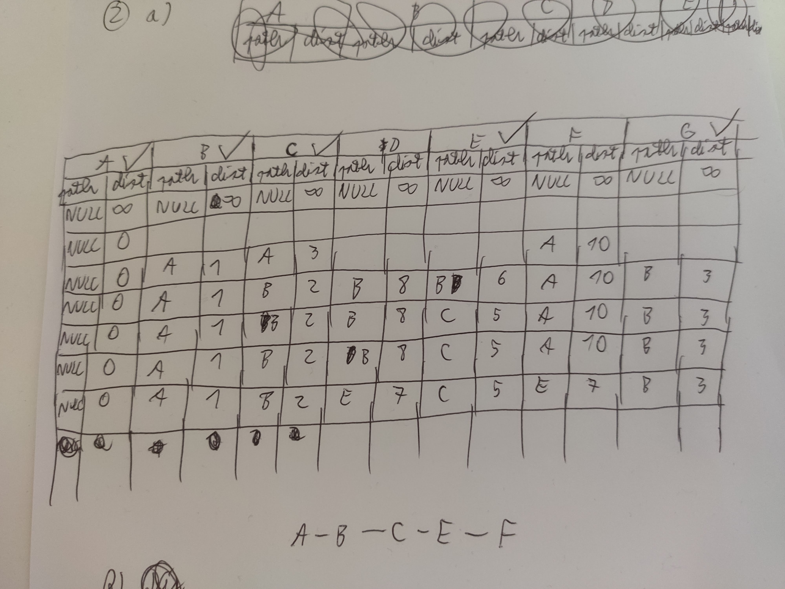
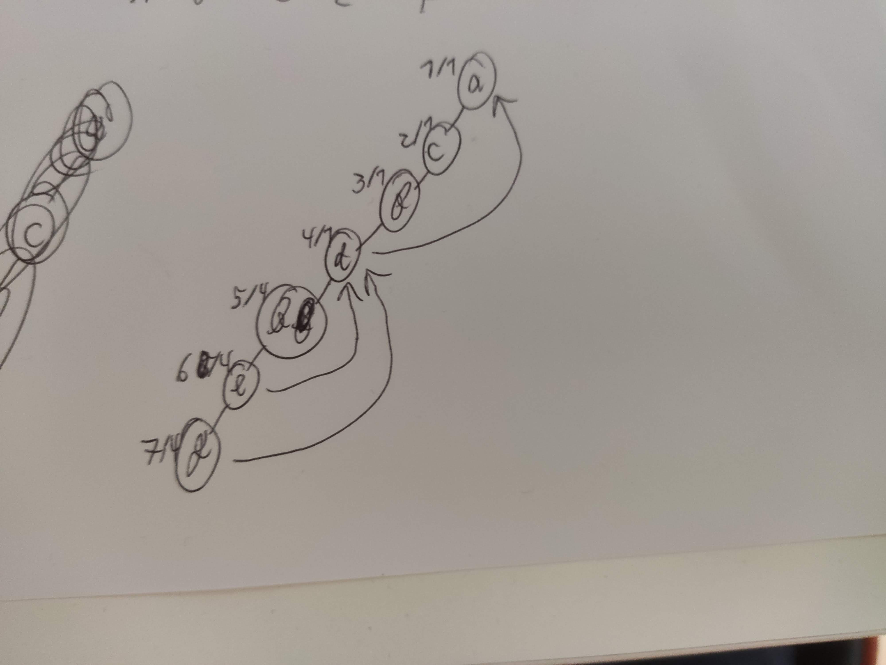
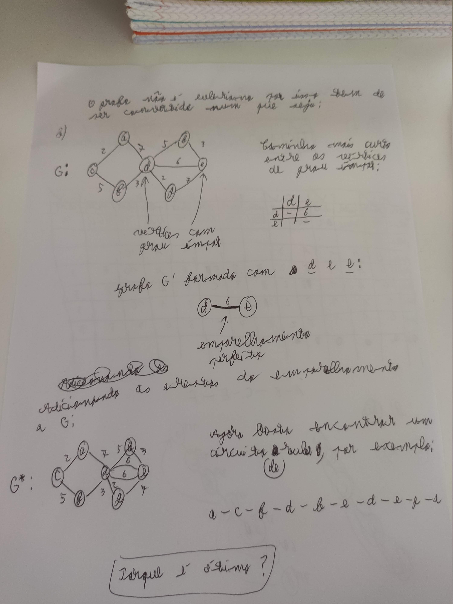
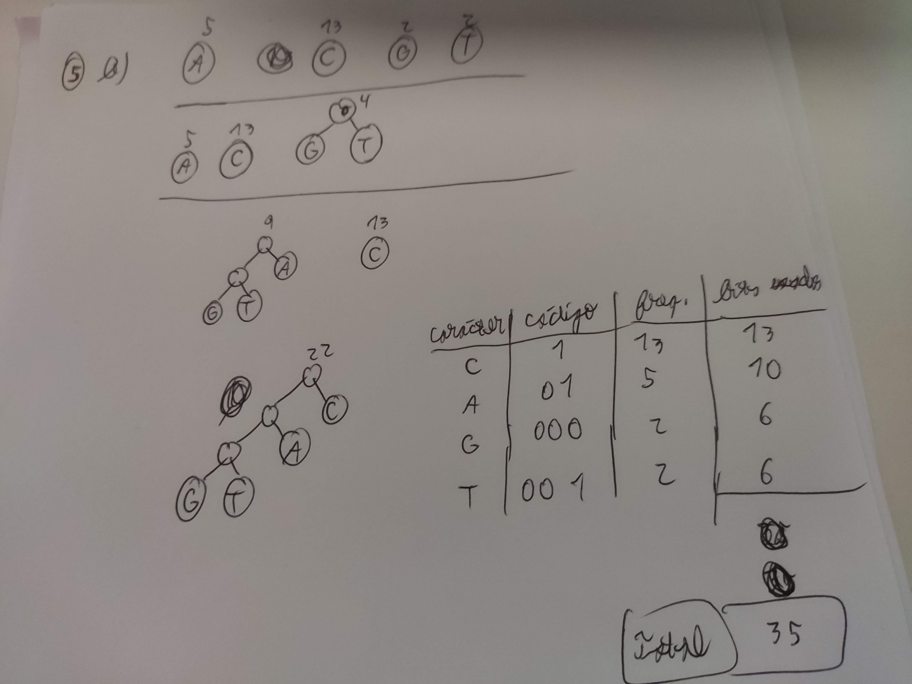

### 2.
### a)

### b) (ver ficheiro cpp)

### 3.
### a)

### b)

O vértice **d** é um ponto de articulação.

## 4.
### a) A rede não é capaz de dar resposta ao número de viagens estimado. Para sabermos o fluxo máximo podemos descobrir a capacidade do corte mínimo. No caso deste grafo, o valor da capacidade do corte mínimo é 7. Mesmo que se use o volume de uma auto-estrada, o fluxo horário máximo será 2000 * 7 = 14000. Portanto, esta rede não é capaz de dar resposta à estimativa fornecida de 18000 veículos por hora.
### c) O troço da A8 entre as cidades C1 e C2 visto que tem grande capacidade, e sendo uma auto-estrada tem um maior volume horário. (?)

## 5.
### a) Visto que o tamanho do alfabeto é 4 e 2^2=4, apenas precisamos de 2 bits para representar cada carácter. Como o gene XPTO possui 22 caracteres, no total serão necessários 22*2=44 bits para codificar o gene todo. (?)
### b)
